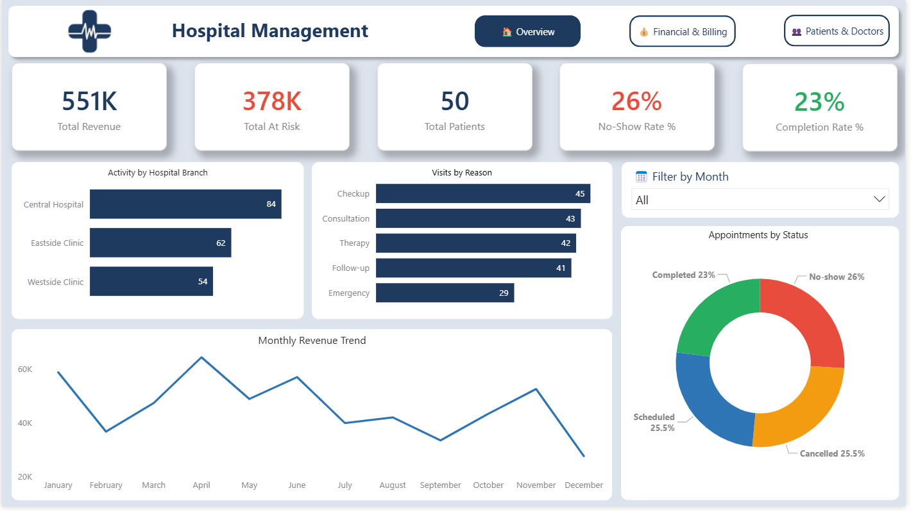
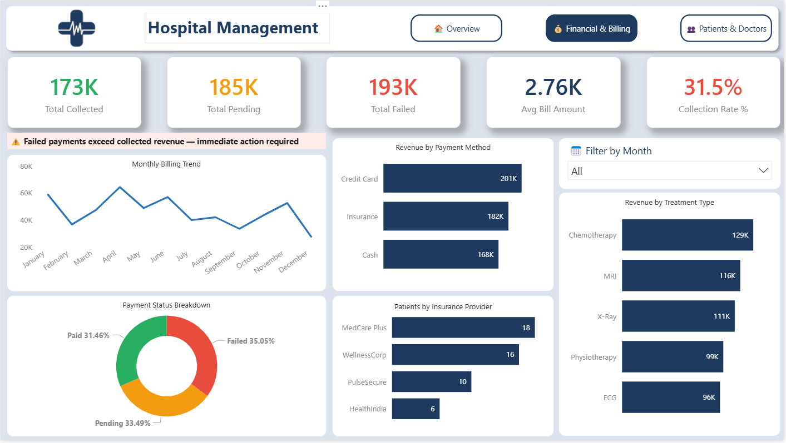
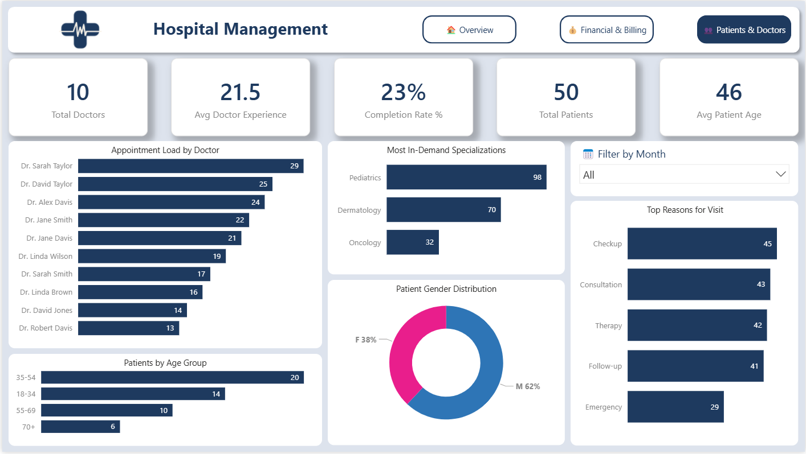

# 🏥 Hospital Management Dashboard — Power BI

> *Transforming raw hospital data into an executive decision-support tool — built to answer "What needs attention right now?"*



---

## 📌 Project Overview

A 3-page interactive Power BI dashboard built for **hospital executive management**, designed around operational decision support rather than just data display. The dashboard covers revenue health, billing exposure, appointment operations, patient demographics, and doctor workload — all filterable by month with a unified Date Table slicer.

The project was inspired by a key insight: most hospital dashboards are great at *showing* information, but few are designed to *support decisions*. Every visual in this dashboard is built around a specific business question a CEO would actually ask.

---

## 🛠️ Tools Used

| Tool | Purpose |
|---|---|
| Power BI Desktop | Dashboard design and visualisation |
| Power Query | Data loading, cleaning, and transformation |
| DAX | 21 measures across 5 measure groups |

---

## 📂 Project Structure

```
hospital-management-dashboard/
├── README.md
├── data/
│   ├── patients.csv
│   ├── doctors.csv
│   ├── appointments.csv
│   ├── treatments.csv
│   └── billing.csv
├── dashboard/
│   └── hospital_management.pbix
└── assets/
    ├── page1_overview.png
    ├── page2_billing.png
    └── page3_patients_doctors.png
```

---

## 🔄 Project Phases

### Phase 1 — Power Query (Data Cleaning & Transformation)
- Loaded 5 CSV tables: 50 patients, 10 doctors, 200 appointments, 200 treatments, 200 billing records
- Corrected data types across all tables (dates, decimals, text IDs)
- Added calculated columns:
  - `full_name` and `doctor_name` (name formatting)
  - `age` and `age_group` (Under 18 / 18–34 / 35–54 / 55–69 / 70+)
  - `experience_group` (Junior / Mid-level / Senior)
  - `is_noshow`, `is_cancelled`, `is_completed` flag columns (0/1)
  - `is_paid`, `is_at_risk` flag columns (0/1)
  - `Month Name` and `Month Number` for correct time sorting

### Phase 2 — Data Model
- Built a star-schema model with appointments as the central fact table
- Created a dedicated `DateTable` using DAX `CALENDAR()` to unify all date filters
- Established 4 active relationships and 1 inactive (treatments bypassed via appointments chain)

| Relationship | Cardinality |
|---|---|
| patients → appointments | 1 to Many |
| doctors → appointments | 1 to Many |
| appointments → treatments | 1 to 1 |
| patients → billing | 1 to Many |
| DateTable → appointments | 1 to Many |
| DateTable → billing | 1 to Many |

### Phase 3 — DAX Measures (21 Measures, 5 Groups)
- **_RevenueMeasures** — Total Revenue, Total Collected, Total Pending, Total Failed, Avg Bill Amount, Collection Rate %
- **_AppointmentMeasures** — Total Appointments, Completed, Cancelled, No-Show, Completion Rate %, No-Show Rate %, Cancellation Rate %
- **_PatientMeasures** — Total Patients, Avg Patient Age
- **_DoctorMeasures** — Total Doctors, Avg Doctor Experience
- **_KPIFlagMeasures** — No-Show Flag, At Risk Flag, Collection Flag (Red/Yellow/Green conditional logic)

### Phase 4 — Dashboard Design
- 3-page layout with a consistent navigation bar and unified month slicer
- White card containers on a light grey canvas (`#DDE3ED`) for depth and hierarchy
- Color-coded KPI cards (Green = good, Amber = monitor, Red = action required)
- Revenue Trend chart set to ignore the month slicer — always shows full year context

---

## 📄 Dashboard Pages

### Page 1 — Executive Overview
*"How is the hospital performing, and what needs my attention today?"*

| Visual | Insight |
|---|---|
| 5 KPI Cards | Revenue, At Risk billing, Patients, No-Show Rate, Completion Rate |
| Monthly Revenue Trend | Full year pattern — slicer independent |
| Activity by Hospital Branch | Which branch drives the most volume |
| Visits by Reason | Why patients are coming in |
| Appointments by Status | Completed vs Cancelled vs No-show vs Scheduled |


---

### Page 2 — Financial & Billing
*"Where is money coming in from, and where is it leaking?"*

| Visual | Insight |
|---|---|
| 5 KPI Cards | Collected, Pending, Failed, Avg Bill, Collection Rate % |
| ⚠️ Alert Banner | "Failed payments exceed collected revenue — immediate action required" |
| Monthly Billing Trend | Revenue trajectory across the year |
| Payment Status Breakdown | Paid vs Pending vs Failed (donut) |
| Revenue by Payment Method | Cash vs Insurance vs Credit Card |
| Revenue by Treatment Type | Which treatments generate the most revenue |
| Patients by Insurance Provider | Coverage distribution across providers |



---

### Page 3 — Patients & Doctors
*"Who are our patients, and how efficiently are our doctors working?"*

| Visual | Insight |
|---|---|
| 5 KPI Cards | Doctors, Avg Experience, Completion Rate, Patients, Avg Age |
| Appointment Load by Doctor | Workload distribution across all 10 doctors |
| Most In-Demand Specializations | Where patient demand is concentrated |
| Patient Gender Distribution | M/F split (pink/blue donut) |
| Patients by Age Group | Demographic breakdown |
| Top Reasons for Visit | Checkup, Consultation, Therapy, Follow-up, Emergency |



---

## 💡 Key Insights

- 🔴 **Only 31.5% of billing is actually collected** — the hospital is collecting less than a third of what it bills
- 🔴 **Failed payments (193K) exceed collected revenue (173K)** — a critical financial red flag
- 🔴 **26% no-show rate** — over 1 in 4 appointments results in a no-show, a significant operational waste
- 🏥 **Central Hospital handles 42% of all appointments** — disproportionate load vs other branches
- 💊 **Chemotherapy generates the highest treatment revenue** at 129K — followed by MRI (116K) and X-Ray (111K)
- 👨‍⚕️ **Dr. Sarah Taylor carries the highest appointment load** (29 appointments) — nearly double the lowest doctor
- 👶 **Pediatrics dominates specialization demand** with 98 appointments — more than Dermatology and Oncology combined
- 👥 **35–54 age group is the largest patient segment** — 40% of total patients
- 💳 **Credit Card is the top payment method** at 201K — slightly ahead of Insurance (182K) and Cash (168K)

---

## 📸 Dashboard Preview

| Page 1 — Executive Overview | Page 2 — Financial & Billing | Page 3 — Patients & Doctors |
|---|---|---|
|  |  |  |

---

## 🎯 Recommendations

### 📄 Page 1 — Executive Overview

| Problem Found | Recommendation |
|---|---|
| **26% no-show rate** | Introduce SMS/WhatsApp appointment reminders 24–48hrs before the appointment. Consider a small deposit or cancellation policy for new patients to reduce ghost bookings |
| **Only 23% completion rate** | Investigate root cause — separate no-shows from cancellations and identify whether the issue is patient-side or operational. Track by doctor and branch to isolate the problem |
| **Central Hospital carries 42% of all appointments** | Redistribute capacity to Eastside and Westside Clinics through scheduling policies or by rotating high-demand doctors across branches |

---

### 📄 Page 2 — Financial & Billing

| Problem Found | Recommendation |
|---|---|
| **Failed payments (193K) exceed collected revenue (173K)** | Urgently audit all failed payment records — determine if this is a system processing error or genuine non-payment. Introduce payment verification before appointment confirmation |
| **Only 31.5% collection rate** | Set a 60-day target of 50%+ collection rate. Assign a dedicated billing follow-up team to chase pending and failed payments systematically |
| **185K sitting in pending** | Automate billing reminders at 7, 14, and 30-day intervals after bill issuance. Offer payment plans for large balances to increase recovery |
| **Cash is the lowest payment method** | Cash is the hardest to track and recover. Incentivize digital payments (card/insurance) with small priority booking benefits |

---

### 📄 Page 3 — Patients & Doctors

| Problem Found | Recommendation |
|---|---|
| **Dr. Sarah Taylor has 29 appointments vs Dr. Robert Davis with 13** | Implement a maximum appointment cap per doctor per month. Redirect overflow bookings to lower-load doctors automatically through the scheduling system |
| **Pediatrics has 98 appointments vs Oncology with 32** | Consider hiring an additional Pediatrics specialist or extending Pediatrics consultation hours to meet demand without overloading existing doctors |
| **70+ age group is the smallest segment (6 patients)** | Launch targeted outreach for elderly patients — offer home visit options, telemedicine consultations, or partnerships with elderly care facilities |
| **35–54 is the dominant age group** | This segment drives the most volume — prioritize services that match their needs (preventive care, chronic disease management, follow-up programs) |

---

## 💡 How to Use

1. Clone or download the repository
2. Open `hospital_management.pbix` in Power BI Desktop
3. If data doesn't load, go to **Home → Transform Data → Data Source Settings** and update the CSV file paths
4. Use the **Month slicer** on any page to filter all visuals simultaneously
5. The Revenue Trend line chart intentionally ignores the month filter to preserve annual context

---

## 👤 Author

**Mohamed Esam Ragab**
Junior Data Analyst
[LinkedIn](https://linkedin.com/in/mohamed-esam) · [GitHub](https://github.com/mo-esam12)

---

*This project is part of my data analytics portfolio demonstrating end-to-end skills in Power Query data transformation, DAX measure writing, data modelling, and executive dashboard design in Power BI.*
